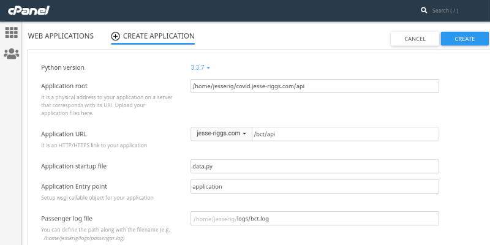

# Better Covid Tracker Web Deployment
The Better Covid Tracker is powered by React and utilizes the Arwes framework to show useful, unbiased statistics concerning the CoVid19 pandemic; in a cool, futuristic, SciFi kinda way.
## Get Started
Building the React frontend of BCT requires [NodeJS](https://nodejs.org/ "Learn About NodeJS!") and a copy of BetterCovidTracker source code. Get started by cloning this repo:
```sh
user@local$ git clone https://github.com/Pewcrafter/BetterCovidTracker
```
and then install the dependencies:
```sh
user@local$ cd BetterCovidTracker/web/the-better-covid-tracker/
user@local$ npm install
```
In order to use `HeatMap`, an instance of `flaskr` database server must also be running on port 5000. After installing Python and Flask, from `BetterCovidTracker` run:
```sh
user@local$ venv/bin/activate
user@local$ export FLASK_APP=flaskr
user@local$ flask run
```
To use `TimeSeries`, we must generate the appropriate JSON files to serve to the app. From `BetterCovidTracker/web/the-better-covid-tracker/`, do:
```sh
user@local$ cd public/data/
user@local$ ./autogen.sh
```
Now, from `BetterCovidTracker/web/the-better-covid-tracker/`, BCT can be run:
```sh
user@local$ npm start
```
## Docker
BCT is also ready to be deployed from Docker. From Powershell run:
```sh
docker build  -t the-better-covid-tracker:dev .
docker run -it --rm -v ${PWD}:/app -v /app/node_modules -p 3001:3000 -e CHOKIDAR_USEPOLLING=true the-better-covid-tracker:dev
```
BCT can now be accessed from [http://localhost:3001](http://localhost:3000).

## Available Scripts
In the project directory, you can run:
#### `npm start`
Runs the app in the development mode. Open [http://localhost:3000](http://localhost:3000) to view it in the browser. The page will reload if you make edits.
#### `npm test`
Launches the test runner in the interactive watch mode. See the section about [running tests](https://facebook.github.io/create-react-app/docs/running-tests) for more information.
#### `npm run build`
Builds the app for production to the `build` folder. It correctly bundles React in production mode and optimizes the build for the best performance. The build is minified and the filenames include the hashes. Your app is ready to be deployed!
## Preparing For Deployment
Better Covid Tracker can also be deployed from an Apache webserver. React builds a static web page, which can be copied directly to the server. However, the Python backend does not run natively. So, we have to create an entry point for WSGI. Deployment is done in three steps:
* prepare Apache server to run an instance of a Flask app
* prepare and build Better Covid Tracker web app
* scp the newly built application to the Apache server

### Preparing Apache
**Note:** If you'd like to run this on your personal server, without CPanel, chekc out [mod wsgi](https://modwsgi.readthedocs.io/en/master/) for more information.<br />

The "easiest" way to do this is ( probably ) with Apache Passenger, from `CPanel > Software > Setup Python App`, and then click `CREATE APPLICATION`.
Select Python 3.<br />

Now enter the application root `/path/to/application/root/api`. And then enter your application URL `host/api`.<br />
**Note:** Both of these paths must end with `api`.<br />

Application startup file must be `data.py` and entry point must be `application`.



Now, hit `SAVE` and then `RESTART`. **Notice** that there is now a path to a virtual environment, shown at the top of the screen. You need to copy this, and then past it into your shell, on your server. Now, you can install flask:
```sh
(venv)[user@remote api]$ pip install flask
```
### Prepare And Then Build Web App
First, we want to change the database server from localhost to our new Appache entry point.
```javascript
/*
 * from `src/Data/Data.js` change
const confirmed    = "/state/confirmed";
const deaths       = "/state/deaths";
 * to:
 */
const confirmed    = "/api/state/confirmed";
const deaths       = "/api/state/deaths";
```
Now, from `BetterCovidTracker/web/the-better-covid-tracker/` run:
```sh
user@local$ npm run build
```
After this script completes, there will be a directory `build/`, which contains the new build. This is where we will copy flaskr.
```sh
user@local$ cp -r ../../flaskr build/api/
user@local$ cp -r ../../instance build/api/
```
### Deploy To Server
Now, if all goes well?, we should be able to scp everything to our server, and things will just magically run.
```sh
user@local$ scp -r ./ user@remote:/path/to/application/root/
```
**Note:** this will overwrite the data.js entrypoint that was automatically created by Passenger. This is correct. :)

Now, check your page to see if it's installed correctly.
